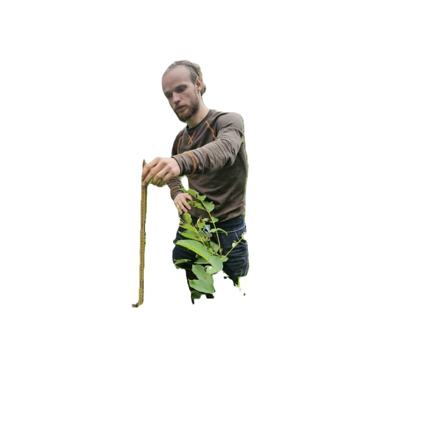
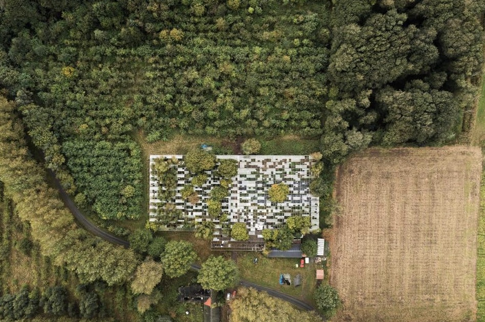
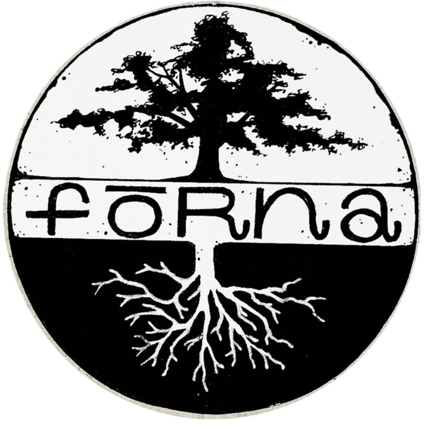

::: {.home-layout}
::: {.home-main}
::: {.hero}
::: {.hero__inner}
# Förna Matskogar

## Från gräsrot till pålrot

Förna utgår från byn Bästekille, strax utanför Kivik, där vi arrenderar ett tidigare övergivet växthus sedan hösten 2023. Här bygger vi steg för steg upp en plats för plantskola, perenna odlingssystem, annuell odling och samskapande.

[Se plantskolan](produkter.qmd){.cta-button}
[Kontakta oss](kontakt.qmd){.cta-button .cta-button--ghost}
:::
:::

::: {.metric-grid}
::: {.metric-card}
### 3500 kvm

Växthusyta att återta, odla upp och förvalta tillsammans.
:::
::: {.metric-card}
### 480 kvm

Bäddyta med droppbevattning på hela ytan.
:::
::: {.metric-card}
### 1 gång i månaden

Öppna arbetsdagar med lunch, fika och praktiskt arbete.
:::
:::

::: {.split-grid}
::: {.content-card}
## Övergripande presentation

Förna drivs idag av Fabian Ryft och Gustaf Blom, men verksamheten har vuxit fram genom ett större gemensamt arbete tillsammans med vänner, familj, grannar, lokala företagare och människor som bara velat hjälpa till.

Under den första tiden handlade mycket om att röja undan stora mängder krossat glas, gammal plast och en hel skog som hade vuxit inne i växthuset. Sakta men säkert anpassar vi platsen efter framtida behov.

Namnet Förna pekar mot det vi vill skapa. Förnan är lagret av löv och organiskt material som bildas under träd när en skog tar form. Den ligger i mötet mellan jord, vatten, luft och eld och är själva grunden för ett levande odlingssystem.
:::
::: {.content-card}
## Det här gör vi

- Vi driver en plantskola med fokus på perenna växter, nöt- och fruktträd, bärbuskar och tillbehör.
- Vi erbjuder rådgivning, etablering, skötsel och förvaltning av matskogar, alléodlingar och andra fleråriga odlingssystem.
- Vi odlar även annuella grödor för försäljning, eget bruk och samverkan med grannar och förädlare.
- Vi bjuder in till återkommande samskapardagar där fler kan delta i upprustning, plantering, skötsel och skörd.
:::
:::

::: {.section-block}
## Varför vi gör det

Vi ser hälsosamma landskap, levande jordar och rent vatten som grunden för mänsklig välfärd. Förna Matskogar är vårt sätt att ta ansvar lokalt för en framtid där människa och landskap regenererar tillsammans.
:::

::: {.info-grid}
::: {.info-card}
### Vårt uppdrag

Vi vill bidra till att en ny bransch inom jordbruket får ta form, där fler människor kan försörja sig på att vårda landskapen och producera mat i perenna system.

[Läs mer](uppdrag.qmd)
:::
::: {.info-card}
### Tjänster

Vi arbetar med etablering, förvaltning, trädfällning, beskärning, röjning och anläggning av rishäckar.

[Se tjänster](tjanster.qmd)
:::
::: {.info-card}
### Samskapardagar

En gång i månaden bjuder vi in till praktiskt arbete, samtal, soppa, kaffe och gemenskap på Förna.

[Till samskapardagar](samskapardagar.qmd)
:::
:::

::: {.split-grid}
::: {.content-card}
## Kontakt

### Fabian Ryft

Frågor kring samskapardagar, trädgårdstjänster och etablering av odlingssystem.

Ring eller sms:a `0766-148318`

### Gustaf Blom

Frågor om växthuset, plantskolan och den annuella odlingen.

Ring eller sms:a `0790-183550`
:::
::: {.content-card}
{width=100% fig-alt="Förna i Bästekille"}
:::
:::

::: {.feature-photo}
{width=100% fig-alt="Flygbild över växthuset i Förna"}

## Förna från ovan

Växthuset i Bästekille är både arbetsplats, plantskola och experimentverkstad. Här syns platsen i sin helhet, mitt i landskapet som vi vill vara med och reparera och förvalta långsiktigt.
:::

::: {.section-block}
## Bildflöde

```{=html}
<div class="image-marquee" aria-label="Bildspel från Förna">
  <div class="image-marquee__track">
    
    
    
    
    
    
    
    
    
    
    
    
  </div>
</div>
```
:::
:::

::: {.home-rail}
::: {.rail-logo-card}
{.rail-logo-image fig-alt="Förna logga"}
:::
:::
:::
