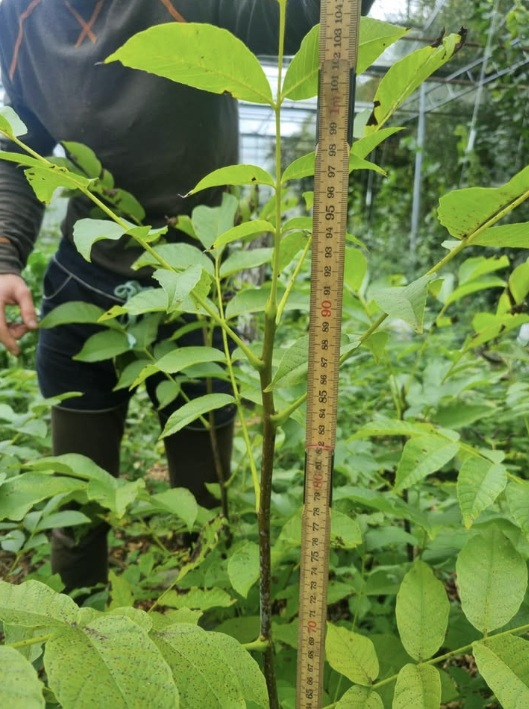
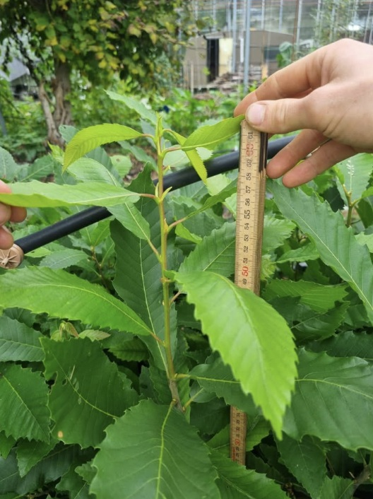

---
title: "Våra produkter"
---

```{=html}
<link rel="stylesheet" href="assets/css/shop.css">
<section id="catalog-cart-status" class="catalog-cart-status" aria-live="polite"></section>
```

## Våra träd

::: {.grid}
::: {.g-col-6 .g-col-md-3 style="text-align:center;"}
{width=100%}
**Juglans 15 cm**  
Små valnötsträd – redo att sätta fart.
:::

::: {.g-col-6 .g-col-md-3 style="text-align:center;"}
{width=100%}
**Juglans 90 cm**  
Rejäla ettåringar med drag i stammen.
:::

::: {.g-col-6 .g-col-md-3 style="text-align:center;"}
{width=100%}
**Castanea sativa**  
Kraftfulla kastanjplantor från Baskemölla.
:::

::: {.g-col-6 .g-col-md-3 style="text-align:center;"}
{width=100%}
**Juglans regia**  
Valnötsträd som växer där framtiden gror.
:::
:::

---

## Äkta valnöt (*Juglans regia*)

{width=60% align="center"}

Vi jobbar med naturlig selektion av **valnötsträd** – direkt från *Professorstaden i Lund*.  
Varje nöt är handplockad för att få fram starka träd med bred genetisk bas och goda framtidsutsikter.

Träden levereras **barrotade** – för att ge rötterna bästa möjliga start.  
Plantera när du vill (så länge marken inte är frusen).

### Prislista – Äkta valnöt

```{=html}
<div class="catalog-table-wrap">
  <table class="catalog-table">
    <thead>
      <tr>
        <th scope="col">Storlek</th>
        <th scope="col">Pris</th>
        <th scope="col">Lägg i varukorg</th>
      </tr>
    </thead>
    <tbody>
      <tr class="js-product-row" data-id="juglans-05" data-name="Äkta valnöt" data-size="5+ cm" data-price-sek="50">
        <td>5+ cm</td>
        <td>50 kr</td>
        <td>
          <div class="qty-control" role="group" aria-label="Antal Äkta valnöt 5+ cm">
            <button type="button" class="qty-btn" data-action="minus" data-id="juglans-05" aria-label="Minska antal Äkta valnöt 5+ cm">-</button>
            <output class="qty-value js-cart-qty" data-id="juglans-05">0</output>
            <button type="button" class="qty-btn" data-action="plus" data-id="juglans-05" aria-label="Öka antal Äkta valnöt 5+ cm">+</button>
          </div>
        </td>
      </tr>
      <tr class="js-product-row" data-id="juglans-10" data-name="Äkta valnöt" data-size="10+ cm" data-price-sek="100">
        <td>10+ cm</td>
        <td>100 kr</td>
        <td>
          <div class="qty-control" role="group" aria-label="Antal Äkta valnöt 10+ cm">
            <button type="button" class="qty-btn" data-action="minus" data-id="juglans-10" aria-label="Minska antal Äkta valnöt 10+ cm">-</button>
            <output class="qty-value js-cart-qty" data-id="juglans-10">0</output>
            <button type="button" class="qty-btn" data-action="plus" data-id="juglans-10" aria-label="Öka antal Äkta valnöt 10+ cm">+</button>
          </div>
        </td>
      </tr>
      <tr class="js-product-row" data-id="juglans-20" data-name="Äkta valnöt" data-size="20+ cm" data-price-sek="150">
        <td>20+ cm</td>
        <td>150 kr</td>
        <td>
          <div class="qty-control" role="group" aria-label="Antal Äkta valnöt 20+ cm">
            <button type="button" class="qty-btn" data-action="minus" data-id="juglans-20" aria-label="Minska antal Äkta valnöt 20+ cm">-</button>
            <output class="qty-value js-cart-qty" data-id="juglans-20">0</output>
            <button type="button" class="qty-btn" data-action="plus" data-id="juglans-20" aria-label="Öka antal Äkta valnöt 20+ cm">+</button>
          </div>
        </td>
      </tr>
      <tr class="js-product-row" data-id="juglans-30" data-name="Äkta valnöt" data-size="30+ cm" data-price-sek="200">
        <td>30+ cm</td>
        <td>200 kr</td>
        <td>
          <div class="qty-control" role="group" aria-label="Antal Äkta valnöt 30+ cm">
            <button type="button" class="qty-btn" data-action="minus" data-id="juglans-30" aria-label="Minska antal Äkta valnöt 30+ cm">-</button>
            <output class="qty-value js-cart-qty" data-id="juglans-30">0</output>
            <button type="button" class="qty-btn" data-action="plus" data-id="juglans-30" aria-label="Öka antal Äkta valnöt 30+ cm">+</button>
          </div>
        </td>
      </tr>
      <tr class="js-product-row" data-id="juglans-40" data-name="Äkta valnöt" data-size="40+ cm" data-price-sek="250">
        <td>40+ cm</td>
        <td>250 kr</td>
        <td>
          <div class="qty-control" role="group" aria-label="Antal Äkta valnöt 40+ cm">
            <button type="button" class="qty-btn" data-action="minus" data-id="juglans-40" aria-label="Minska antal Äkta valnöt 40+ cm">-</button>
            <output class="qty-value js-cart-qty" data-id="juglans-40">0</output>
            <button type="button" class="qty-btn" data-action="plus" data-id="juglans-40" aria-label="Öka antal Äkta valnöt 40+ cm">+</button>
          </div>
        </td>
      </tr>
      <tr class="js-product-row" data-id="juglans-50" data-name="Äkta valnöt" data-size="50+ cm" data-price-sek="300">
        <td>50+ cm</td>
        <td>300 kr</td>
        <td>
          <div class="qty-control" role="group" aria-label="Antal Äkta valnöt 50+ cm">
            <button type="button" class="qty-btn" data-action="minus" data-id="juglans-50" aria-label="Minska antal Äkta valnöt 50+ cm">-</button>
            <output class="qty-value js-cart-qty" data-id="juglans-50">0</output>
            <button type="button" class="qty-btn" data-action="plus" data-id="juglans-50" aria-label="Öka antal Äkta valnöt 50+ cm">+</button>
          </div>
        </td>
      </tr>
      <tr class="js-product-row" data-id="juglans-60" data-name="Äkta valnöt" data-size="60+ cm" data-price-sek="350">
        <td>60+ cm</td>
        <td>350 kr</td>
        <td>
          <div class="qty-control" role="group" aria-label="Antal Äkta valnöt 60+ cm">
            <button type="button" class="qty-btn" data-action="minus" data-id="juglans-60" aria-label="Minska antal Äkta valnöt 60+ cm">-</button>
            <output class="qty-value js-cart-qty" data-id="juglans-60">0</output>
            <button type="button" class="qty-btn" data-action="plus" data-id="juglans-60" aria-label="Öka antal Äkta valnöt 60+ cm">+</button>
          </div>
        </td>
      </tr>
      <tr class="js-product-row" data-id="juglans-70" data-name="Äkta valnöt" data-size="70+ cm" data-price-sek="400">
        <td>70+ cm</td>
        <td>400 kr</td>
        <td>
          <div class="qty-control" role="group" aria-label="Antal Äkta valnöt 70+ cm">
            <button type="button" class="qty-btn" data-action="minus" data-id="juglans-70" aria-label="Minska antal Äkta valnöt 70+ cm">-</button>
            <output class="qty-value js-cart-qty" data-id="juglans-70">0</output>
            <button type="button" class="qty-btn" data-action="plus" data-id="juglans-70" aria-label="Öka antal Äkta valnöt 70+ cm">+</button>
          </div>
        </td>
      </tr>
      <tr class="js-product-row" data-id="juglans-80" data-name="Äkta valnöt" data-size="80+ cm" data-price-sek="450">
        <td>80+ cm</td>
        <td>450 kr</td>
        <td>
          <div class="qty-control" role="group" aria-label="Antal Äkta valnöt 80+ cm">
            <button type="button" class="qty-btn" data-action="minus" data-id="juglans-80" aria-label="Minska antal Äkta valnöt 80+ cm">-</button>
            <output class="qty-value js-cart-qty" data-id="juglans-80">0</output>
            <button type="button" class="qty-btn" data-action="plus" data-id="juglans-80" aria-label="Öka antal Äkta valnöt 80+ cm">+</button>
          </div>
        </td>
      </tr>
      <tr class="js-product-row" data-id="juglans-90" data-name="Äkta valnöt" data-size="90+ cm" data-price-sek="500">
        <td>90+ cm</td>
        <td>500 kr</td>
        <td>
          <div class="qty-control" role="group" aria-label="Antal Äkta valnöt 90+ cm">
            <button type="button" class="qty-btn" data-action="minus" data-id="juglans-90" aria-label="Minska antal Äkta valnöt 90+ cm">-</button>
            <output class="qty-value js-cart-qty" data-id="juglans-90">0</output>
            <button type="button" class="qty-btn" data-action="plus" data-id="juglans-90" aria-label="Öka antal Äkta valnöt 90+ cm">+</button>
          </div>
        </td>
      </tr>
    </tbody>
  </table>
</div>
```

---

## Äkta kastanj (*Castanea sativa*)

{width=60% align="center"}

Kastanjerna kommer från *Baskemölla* – ett havsnära fröparadis.  
Vi väljer varje nöt för hand och låter naturen styra urvalet. Målet? Träd med livskraft, variation och edge.

Självklart säljs även kastanjerna **barrotade** – för maximalt tryck i tillväxten.

### Prislista – Äkta kastanj

```{=html}
<div class="catalog-table-wrap">
  <table class="catalog-table">
    <thead>
      <tr>
        <th scope="col">Storlek</th>
        <th scope="col">Pris</th>
        <th scope="col">Lägg i varukorg</th>
      </tr>
    </thead>
    <tbody>
      <tr class="js-product-row" data-id="castanea-05" data-name="Äkta kastanj" data-size="5+ cm" data-price-sek="100">
        <td>5+ cm</td>
        <td>100 kr</td>
        <td>
          <div class="qty-control" role="group" aria-label="Antal Äkta kastanj 5+ cm">
            <button type="button" class="qty-btn" data-action="minus" data-id="castanea-05" aria-label="Minska antal Äkta kastanj 5+ cm">-</button>
            <output class="qty-value js-cart-qty" data-id="castanea-05">0</output>
            <button type="button" class="qty-btn" data-action="plus" data-id="castanea-05" aria-label="Öka antal Äkta kastanj 5+ cm">+</button>
          </div>
        </td>
      </tr>
      <tr class="js-product-row" data-id="castanea-10" data-name="Äkta kastanj" data-size="10+ cm" data-price-sek="150">
        <td>10+ cm</td>
        <td>150 kr</td>
        <td>
          <div class="qty-control" role="group" aria-label="Antal Äkta kastanj 10+ cm">
            <button type="button" class="qty-btn" data-action="minus" data-id="castanea-10" aria-label="Minska antal Äkta kastanj 10+ cm">-</button>
            <output class="qty-value js-cart-qty" data-id="castanea-10">0</output>
            <button type="button" class="qty-btn" data-action="plus" data-id="castanea-10" aria-label="Öka antal Äkta kastanj 10+ cm">+</button>
          </div>
        </td>
      </tr>
      <tr class="js-product-row" data-id="castanea-15" data-name="Äkta kastanj" data-size="15+ cm" data-price-sek="200">
        <td>15+ cm</td>
        <td>200 kr</td>
        <td>
          <div class="qty-control" role="group" aria-label="Antal Äkta kastanj 15+ cm">
            <button type="button" class="qty-btn" data-action="minus" data-id="castanea-15" aria-label="Minska antal Äkta kastanj 15+ cm">-</button>
            <output class="qty-value js-cart-qty" data-id="castanea-15">0</output>
            <button type="button" class="qty-btn" data-action="plus" data-id="castanea-15" aria-label="Öka antal Äkta kastanj 15+ cm">+</button>
          </div>
        </td>
      </tr>
      <tr class="js-product-row" data-id="castanea-20" data-name="Äkta kastanj" data-size="20+ cm" data-price-sek="250">
        <td>20+ cm</td>
        <td>250 kr</td>
        <td>
          <div class="qty-control" role="group" aria-label="Antal Äkta kastanj 20+ cm">
            <button type="button" class="qty-btn" data-action="minus" data-id="castanea-20" aria-label="Minska antal Äkta kastanj 20+ cm">-</button>
            <output class="qty-value js-cart-qty" data-id="castanea-20">0</output>
            <button type="button" class="qty-btn" data-action="plus" data-id="castanea-20" aria-label="Öka antal Äkta kastanj 20+ cm">+</button>
          </div>
        </td>
      </tr>
      <tr class="js-product-row" data-id="castanea-30" data-name="Äkta kastanj" data-size="30+ cm" data-price-sek="300">
        <td>30+ cm</td>
        <td>300 kr</td>
        <td>
          <div class="qty-control" role="group" aria-label="Antal Äkta kastanj 30+ cm">
            <button type="button" class="qty-btn" data-action="minus" data-id="castanea-30" aria-label="Minska antal Äkta kastanj 30+ cm">-</button>
            <output class="qty-value js-cart-qty" data-id="castanea-30">0</output>
            <button type="button" class="qty-btn" data-action="plus" data-id="castanea-30" aria-label="Öka antal Äkta kastanj 30+ cm">+</button>
          </div>
        </td>
      </tr>
      <tr class="js-product-row" data-id="castanea-40" data-name="Äkta kastanj" data-size="40+ cm" data-price-sek="350">
        <td>40+ cm</td>
        <td>350 kr</td>
        <td>
          <div class="qty-control" role="group" aria-label="Antal Äkta kastanj 40+ cm">
            <button type="button" class="qty-btn" data-action="minus" data-id="castanea-40" aria-label="Minska antal Äkta kastanj 40+ cm">-</button>
            <output class="qty-value js-cart-qty" data-id="castanea-40">0</output>
            <button type="button" class="qty-btn" data-action="plus" data-id="castanea-40" aria-label="Öka antal Äkta kastanj 40+ cm">+</button>
          </div>
        </td>
      </tr>
      <tr class="js-product-row" data-id="castanea-50" data-name="Äkta kastanj" data-size="50+ cm" data-price-sek="400">
        <td>50+ cm</td>
        <td>400 kr</td>
        <td>
          <div class="qty-control" role="group" aria-label="Antal Äkta kastanj 50+ cm">
            <button type="button" class="qty-btn" data-action="minus" data-id="castanea-50" aria-label="Minska antal Äkta kastanj 50+ cm">-</button>
            <output class="qty-value js-cart-qty" data-id="castanea-50">0</output>
            <button type="button" class="qty-btn" data-action="plus" data-id="castanea-50" aria-label="Öka antal Äkta kastanj 50+ cm">+</button>
          </div>
        </td>
      </tr>
      <tr class="js-product-row" data-id="castanea-60" data-name="Äkta kastanj" data-size="60+ cm" data-price-sek="450">
        <td>60+ cm</td>
        <td>450 kr</td>
        <td>
          <div class="qty-control" role="group" aria-label="Antal Äkta kastanj 60+ cm">
            <button type="button" class="qty-btn" data-action="minus" data-id="castanea-60" aria-label="Minska antal Äkta kastanj 60+ cm">-</button>
            <output class="qty-value js-cart-qty" data-id="castanea-60">0</output>
            <button type="button" class="qty-btn" data-action="plus" data-id="castanea-60" aria-label="Öka antal Äkta kastanj 60+ cm">+</button>
          </div>
        </td>
      </tr>
    </tbody>
  </table>
</div>
```

```{=html}
<script type="module" src="assets/js/catalog.js"></script>
```
